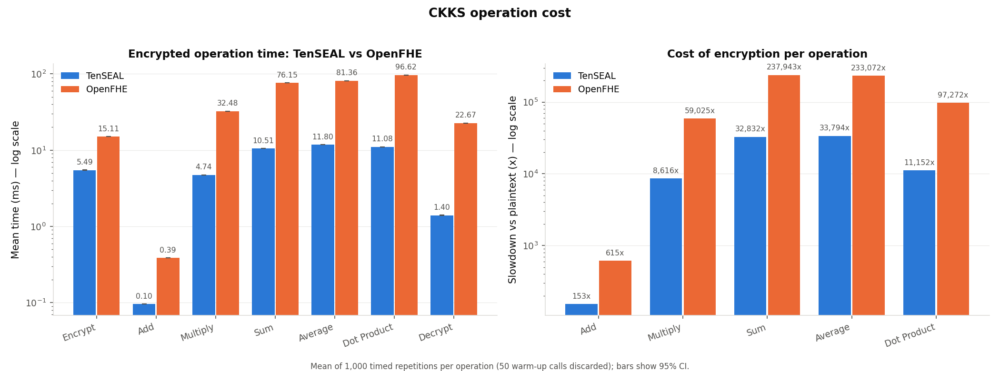
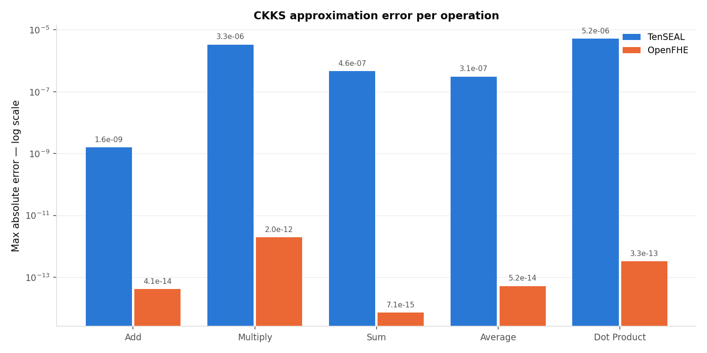
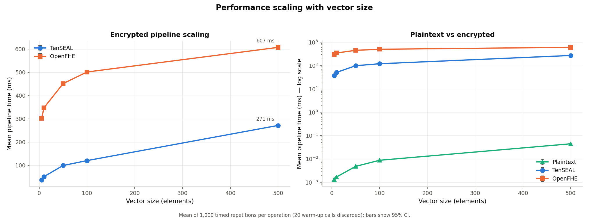
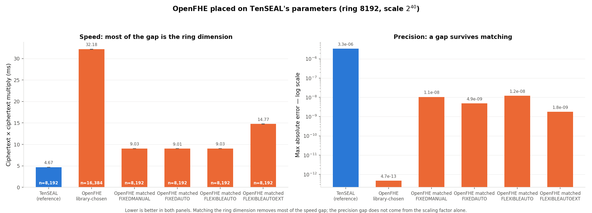
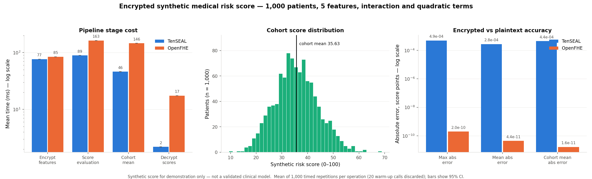
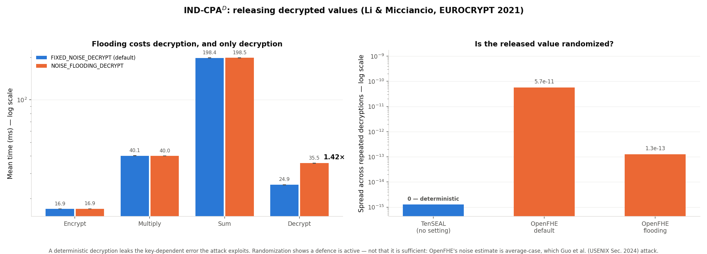

# In-Depth Analysis of Homomorphic Encryption Libraries

## Final Report

**Authors:** Itai Zloclzower, Jacob Shemesh, Tomer Ovadia, Yoni Glickstein

**Course:** Confidential Computing, Ben-Gurion University of the Negev

**Date:** July 2026

---

## 1. Introduction

Homomorphic Encryption (HE) is a cryptographic technique that allows computations to be performed directly on encrypted data. In a regular encryption scheme, data must be decrypted before it can be processed, creating a security gap. HE addresses this by enabling a server or cloud service to compute over ciphertexts without learning the underlying plaintext values.

This project compares two HE library implementations — **TenSEAL** and **OpenFHE** — through a set of encrypted computations. Both implement the **CKKS scheme** (Cheon–Kim–Kim–Song), which supports approximate arithmetic on real numbers and is well-suited to data analytics.

The project has three parts. The first measures the cost of individual encrypted operations against plaintext. The second evaluates a realistic multi-stage computation — a synthetic medical risk score over 1000 encrypted patient records — which turns out to change the cost picture substantially. The third asks whether the scheme is actually secure in the way the scenario needs, which turns out to be the least comfortable question of the three.

## 2. Research Goal

**Research Question:** What is the practical overhead of performing computations using two different homomorphic encryption implementations, compared to equivalent plaintext computation?

Two sub-questions emerged during the work and are answered in §5.8 and §7:

- How much of the measured difference between the libraries is a property of the *libraries*, and how much is a property of the *parameters* we happened to give them?
- Is CKKS confidentiality sufficient for a scenario that releases decrypted results, which ours does?

## 3. Libraries and Scheme

### 3.1 CKKS Scheme

Both libraries use the CKKS scheme, which supports approximate arithmetic over real and complex numbers. Unlike BFV/BGV, which operate on exact integers, CKKS targets applications where small approximation errors are acceptable — machine learning inference, statistical analysis.

Key concepts, all of which matter later:

- **Ring dimension** (polynomial modulus degree) sets the security level and the capacity for computation, and largely determines the cost of every operation.
- **Scaling factor** controls the precision of encoded real numbers.
- **Multiplicative depth** limits sequential multiplications before noise overwhelms the result.
- **Slot packing** lets one ciphertext hold many values, so one homomorphic operation acts on all of them at once (SIMD).

### 3.2 TenSEAL (v0.3.15)

TenSEAL is a Python library built on Microsoft SEAL, providing a high-level API for encrypted tensor operations. Configuration used for the primitive benchmark:

- `poly_modulus_degree = 8192`
- `coeff_mod_bit_sizes = [60, 40, 40, 60]` (200 bits total)
- `global_scale = 2^40`

Encrypted vectors support Python operators (`+`, `*`, `.sum()`), making the code nearly identical to plaintext equivalents. Relinearization and rescaling happen automatically.

### 3.3 OpenFHE (v1.4.1)

OpenFHE is an open-source C++ library with Python bindings, maintained by an academic consortium. It exposes lower-level control. Configuration used for the primitive benchmark:

- `multiplicative_depth = 3`, `scaling_mod_size = 50`, `SecurityLevel = HEStd_128_classic`
- `batch_size` = next power of two of the input length
- resulting ring dimension: **16384**, chosen by the library from the above

The two libraries are configured through different routes — TenSEAL is handed a modulus chain, OpenFHE is handed a depth and asked to find parameters. This is convenient and it is also the source of a serious comparability problem, addressed in §5.8.

## 4. Implementation

### 4.1 Mandatory Operations

| Operation | Description |
|---|---|
| Key Generation | Crypto context creation, key pair generation, evaluation keys |
| Encryption | Encoding a plaintext vector into a ciphertext |
| Addition | Encrypted vector + encrypted vector (element-wise) |
| Multiplication | Encrypted vector × encrypted vector (element-wise) |
| Summation | Sum of all elements in an encrypted vector |
| Average | Sum divided by vector length |
| Decryption | Recovering the plaintext result |

### 4.2 Optional Extensions (All Completed)

| Extension | Description |
|---|---|
| Dot Product | Element-wise multiplication followed by summation |
| Synthetic medical risk score | Multi-feature score with interaction and quadratic terms over 1000 encrypted records (§6) |
| Scaling Test | Vector sizes 5, 10, 50, 100, 500 |
| Key generation timing | Measured separately as a one-off setup cost (§5.3) |
| Matched-parameter comparison | OpenFHE forced onto TenSEAL's parameters (§5.8) |
| IND-CPA$^D$ analysis | Security of releasing decrypted results, and the cost of the defence (§7) |

### 4.3 Measurement Methodology

Timing a homomorphic operation once produces a number that is not reproducible. Every figure in this report is a **mean over 1000 timed repetitions**, taken after a **warm-up phase whose measurements are discarded**.

**Why the warm-up is necessary.** The first calls into either library pay one-off costs that are not part of the steady-state cost of an operation: dynamic loading of the native library, lazy construction of NTT tables and evaluation-key caches, first-touch page faults, and CPU frequency ramp-up. Including them inflates the mean and makes it depend on how many repetitions were run, so two measurements taken with different repetition counts would not be comparable. The benchmark discards 50 warm-up calls per operation (20 for the multi-stage pipelines).

**Robust statistics alongside the mean.** Timing distributions are bounded below and have a long right tail: an unlucky call can be descheduled, but no call can take less time than the work requires. The mean is pulled around by that tail; the median and a 10% trimmed mean are not. The harness records mean, median, trimmed mean, standard deviation, MAD, IQR, p95, p99 and a bootstrap interval for the median, so a difference driven by one outlier can be told apart from a real one.

**Drift detection, and why it changed our conclusions.** The harness compares the mean of the first half of the samples against the second half. If they disagree by more than 5% the measurement is flagged: the samples are not from one distribution, and any confidence interval computed from them is meaningless.

This check was not decoration. Our first full run, on a shared login node, was flagged extensively — first-half and second-half means differed by up to **30.9%** for TenSEAL's dot product and **73.2%** in one matched-comparison arm. The node was carrying a load average of 10.4 on 8 cores. Competing load cannot be averaged away, so all results in this report were re-measured on an **exclusive compute node** with threading pinned. After that change the worst drift on any encrypted measurement was **1.1%**.

**Separating timing from memory measurement.** `tracemalloc` hooks every Python allocation and distorts short timings, so it is never active while the clock is running. Memory is a second pass.

**Suppressing unrelated noise.** Garbage collection is disabled inside the timed loop, as `timeit` does. Each repetition starts from the same freshly encrypted operands, so no repetition inherits accumulated noise or a consumed multiplicative level from the previous one.

**Correctness gates.** Each benchmark asserts that its decrypted results are within a loose bound of the plaintext reference before reporting timings. Without this, a mis-chosen modulus chain produces a benchmark that still runs and still prints plausible numbers computed on garbage.

**Tests.** 40 unit tests cover the statistics (against hand-computed values), the risk score (against a hand-computed patient), and the ciphertext-padding invariant of §6.4.

All of this lives in `benchmark_harness.py` and is shared by every experiment.

### 4.4 Practical Limitation: Batch Size

**OpenFHE requires the batch size to be a power of two**; TenSEAL accepts arbitrary lengths. This required a helper that rounds up, and in §6.4 it also required care about what the padding slots contain, since they participate in every homomorphic operation.

### 4.5 Test Environment

| Component | Value |
|---|---|
| Node | `ise-cpu-intl-18`, allocated **exclusively** via SLURM |
| CPU | Intel Xeon E5-2680 v3 @ 2.50 GHz, 48 cores |
| Threads | `OMP_NUM_THREADS=1` (also OpenBLAS, MKL, NumExpr) |
| Load average at start | 1.01 |
| OS | Rocky Linux 9.7 |
| Python | 3.8.20 |
| TenSEAL / OpenFHE / NumPy | 0.3.15 / 1.4.1 / 1.24.4 |

Measurements are **single-threaded by choice**. Both libraries use multithreaded native code, so on a shared machine their measured cost depends on how many cores they happened to win — which is not a property of the library. Pinning to one thread makes the comparison reproducible and puts both libraries on identical footing. Absolute times are therefore higher than a multithreaded run would give; the ratios are the transferable result.

## 5. Experimental Results

Input vector for the primitive benchmark: `[1.0, 2.0, 3.0, 4.0, 5.0]`. Every timing is the mean of 1000 repetitions after 50 discarded warm-up calls.

### 5.1 Runtime Comparison

| Operation | Plaintext (ms) | TenSEAL (ms) | OpenFHE (ms) | TenSEAL vs plaintext | OpenFHE vs plaintext | OpenFHE / TenSEAL |
|---|---|---|---|---|---|---|
| Encrypt | — | 5.4914 | 15.1101 | — | — | 2.75× |
| Add | 0.000629 | 0.0961 | 0.3869 | 153× | 615× | 4.03× |
| Multiply | 0.000550 | 4.7413 | 32.4827 | 8,616× | 59,025× | 6.85× |
| Sum | 0.000320 | 10.5082 | 76.1546 | 32,832× | 237,943× | 7.25× |
| Average | 0.000349 | 11.7961 | 81.3563 | 33,794× | 233,072× | 6.90× |
| Dot Product | 0.000993 | 11.0764 | 96.6155 | 11,152× | 97,272× | 8.72× |
| Decrypt | — | 1.4029 | 22.6702 | — | — | 16.16× |
| **Total** | **0.002841** | **45.1123** | **324.7763** | **15,876×** | **114,299×** | **7.20×** |



**Key findings:**

- **The per-operation overhead varies by more than two orders of magnitude** — from 153× for addition to 32,832× for summation in TenSEAL. A single aggregate "HE is N× slower" figure hides this completely and is the least useful way to state the result.
- **Addition is nearly free; rotation-heavy operations dominate.** Sum, average and dot product each require a $\log_2(\text{slots})$ sequence of rotate-and-add steps, every one of them a key switch. They cost 100–120× a ciphertext addition.
- TenSEAL is faster on every operation, by 2.75× to 16.2×. **§5.8 shows most of this is a parameter choice rather than a library property.**

### 5.2 Measurement Stability — and a Correction

| Operation | TenSEAL mean (ms) | rel. SD | 95% CI ± | OpenFHE mean (ms) | rel. SD | 95% CI ± |
|---|---|---|---|---|---|---|
| Encrypt | 5.4914 | 2.9% | 0.0097 | 15.1101 | 1.0% | 0.0092 |
| Add | 0.0961 | 2.9% | 0.0002 | 0.3869 | 1.5% | 0.0003 |
| Multiply | 4.7413 | 3.7% | 0.0108 | 32.4827 | 1.0% | 0.0202 |
| Sum | 10.5082 | 1.0% | 0.0065 | 76.1546 | 0.8% | 0.0382 |
| Average | 11.7961 | 3.6% | 0.0261 | 81.3563 | 1.3% | 0.0679 |
| Dot Product | 11.0764 | 0.9% | 0.0061 | 96.6155 | 0.7% | 0.0444 |
| Decrypt | 1.4029 | 2.7% | 0.0024 | 22.6702 | 1.3% | 0.0181 |

**A correction we think is the most important methodological lesson of the project.** An earlier draft argued that because 1000 repetitions drove every confidence interval below a few percent of its mean, the measurements were trustworthy. That reasoning is wrong, and our own data disproved it.

A confidence interval measures how consistent the samples are *with each other*, under the assumption that they are independent draws from one distribution. When a competing job lands on the machine mid-run, that assumption fails — and the interval does not notice. Our contaminated login-node run produced narrow confidence intervals *and* first-to-second-half drifts of up to 73%. The interval was precise and wrong. **Precision is not accuracy, and a confidence interval cannot detect a systematic shift during the run.** Only the drift check caught it, and only an exclusive allocation fixed it.

With that fixed, the relative standard deviations above (0.7%–3.7%, against 6.9%–34.5% on the shared node) reflect the operations rather than the machine.

The cheapest operations remain the hardest to measure: plaintext operations run in ~0.6 µs, where timer overhead and scheduling jitter are comparable to the quantity being measured.

### 5.3 Key Generation

One-off setup cost, timed separately (50 repetitions).

| Library | Mean (ms) | SD (ms) | 95% CI ± | Median (ms) |
|---|---|---|---|---|
| TenSEAL | 216.180 | 1.015 | 0.281 | 215.931 |
| OpenFHE | 208.308 | 0.743 | 0.206 | 208.053 |

Both cover context construction, key pair generation, and the evaluation keys each library needs — relinearization and Galois keys for TenSEAL, multiplication and summation keys for OpenFHE.

**Key finding:** the two are within 4% of each other, and OpenFHE is marginally *faster* — the only measurement in the project where it wins. Setup also dominates short sessions: at 216 ms, TenSEAL's key generation costs nearly five times its entire 45 ms benchmark of encrypted operations. A service creating a fresh context per request would be bottlenecked on setup, not computation.

### 5.4 Memory and Ciphertext Size

The previous version of this report presented `tracemalloc` figures — all below 1 KB — as memory usage. **That was misleading and is corrected here.** `tracemalloc` sees Python allocations only; both libraries hold ciphertext coefficients in native C/C++ heaps that Python never learns about. The sub-kilobyte numbers were the size of Python wrapper objects, not of the ciphertexts they point at.

We therefore added a measurement that allocates many ciphertexts, keeps them alive, and observes the growth in process resident set size:

| Measure | TenSEAL | OpenFHE |
|---|---|---|
| Python-traced (`tracemalloc`), encrypt | 0.59 KB | 0.42 KB |
| **Resident memory per ciphertext** | **359,465 bytes** | **1,258,455 bytes** |
| Serialized ciphertext | 334,428 bytes | 1,312,467 bytes |

**Key findings:**

- The real figure is roughly **six orders of magnitude larger** than the Python-traced one. Any HE memory measurement taken only with `tracemalloc` is meaningless.
- Resident and serialized sizes agree within about 7% for both libraries, which is a useful cross-check: two independent measurements of the same underlying object converge.
- For a 5-element vector, TenSEAL's ciphertext is **334 KB against 40 bytes** of plaintext — an expansion of about **8,360×**. OpenFHE's is 1.3 MB, consistent with its doubled ring dimension.
- This expansion, not RAM, is the practical obstacle in a cloud setting: it is what must cross the network. §6.6 shows the ratio improves greatly when slots are actually used.


### 5.5 Approximation Error

| Operation | TenSEAL max abs error | OpenFHE max abs error | Ratio |
|---|---|---|---|
| Add | $1.57 \times 10^{-9}$ | $4.09 \times 10^{-14}$ | $3.8 \times 10^{4}$ |
| Multiply | $3.35 \times 10^{-6}$ | $1.96 \times 10^{-12}$ | $1.7 \times 10^{6}$ |
| Sum | $4.60 \times 10^{-7}$ | $7.11 \times 10^{-15}$ | $6.5 \times 10^{7}$ |
| Average | $3.10 \times 10^{-7}$ | $5.20 \times 10^{-14}$ | $6.0 \times 10^{6}$ |
| Dot Product | $5.19 \times 10^{-6}$ | $3.27 \times 10^{-13}$ | $1.6 \times 10^{7}$ |



**Key findings:**

- OpenFHE's results are $10^{4}$–$10^{7}$ times more precise in this configuration.
- **Multiplication introduces the largest error in both libraries**, as expected: each multiplication increases ciphertext noise, and rescaling discards precision.
- All errors are negligible for the target application class: healthcare or financial aggregates are meaningful to a few decimal places, and $10^{-6}$ is orders of magnitude below that.
- The cause of this gap is *not* what we initially assumed — see §5.8.

### 5.6 Scaling with Vector Size

End-to-end pipeline time (encrypt + add + multiply + sum + average + decrypt) at increasing vector sizes. Context and key generation happen once per size and are excluded. Each point is the mean of 1000 repetitions.

| Vector size | Plaintext (ms) | TenSEAL (ms) | OpenFHE (ms) | TenSEAL vs plaintext | OpenFHE vs plaintext | OpenFHE / TenSEAL |
|---|---|---|---|---|---|---|
| 5 | 0.001309 | 37.16 | 301.55 | 28,389× | 230,368× | 8.1× |
| 10 | 0.001683 | 51.13 | 347.45 | 30,383× | 206,446× | 6.8× |
| 50 | 0.004772 | 98.95 | 451.32 | 20,735× | 94,576× | 4.6× |
| 100 | 0.008711 | 119.99 | 501.16 | 13,774× | 57,532× | 4.2× |
| 500 | 0.044284 | 271.19 | 607.03 | 6,124× | 13,708× | 2.2× |

Growth from smallest to largest input — a 100× increase in data:

| | Growth in total time | Cost per element, n=5 | Cost per element, n=500 | Improvement |
|---|---|---|---|---|
| Plaintext | 33.8× | 0.000262 ms | 0.000089 ms | 3.0× |
| TenSEAL | 7.3× | 7.43 ms | 0.54 ms | 13.7× |
| OpenFHE | 2.0× | 60.31 ms | 1.21 ms | 49.7× |



**Key findings:**

- **Encrypted computation scales far better than linearly, and this is the strongest practical argument for using HE.** A 100× larger input costs TenSEAL 7.3× more and OpenFHE 2.0× more; plaintext grows 33.8×, essentially linearly.
- **The reason is slot packing.** Cost is set by the ring dimension, not by how many slots hold data. OpenFHE held its ring dimension at 16,384 across the whole sweep, so the dominant cost was identical for 5 elements and for 500. At n=5 the benchmark pays for thousands of slots to compute on five numbers.
- **What grows is the rotation count**: summation is $\log_2(\text{batch size})$ rotate-and-add steps, so a batch of 8 to a batch of 512 adds six rotations.
- **Under-filling ciphertexts is the most wasteful thing you can do in CKKS.** Per-element cost falls 13.7× (TenSEAL) and 49.7× (OpenFHE) between n=5 and n=500 — and even at n=500 neither library is full.
- **Quoting an HE slowdown without stating how full the ciphertexts were is close to meaningless**: OpenFHE's overhead falls from 230,368× to 13,708× across this table alone.

### 5.7 Summary of the Speed/Precision Picture

Taken at face value, §5.1 and §5.5 say "TenSEAL is faster, OpenFHE is more precise." That reading is not supportable, because the two libraries were not given comparable parameters. §5.8 tests it directly.

### 5.8 Matched-Parameter Comparison

**The problem.** TenSEAL ran at ring dimension 8192 with a $2^{40}$ scaling factor; OpenFHE at 16384 with $2^{50}$. OpenFHE was doing twice the polynomial work per operation and keeping ten more bits of each value. Attributing either observation to the library rather than the parameters is unsound.

**The experiment.** OpenFHE's `SetRingDim`, with `SetSecurityLevel(HEStd_NotSet)` to allow a manual choice, pins it to 8192 with a 40-bit scaling factor and a 60-bit first modulus — matching TenSEAL's `[60, 40, 40, 60]`. We also swept OpenFHE's *scaling technique*, which turned out to matter.

| Arm | Ring | Scale | Multiply (ms) | vs TenSEAL | Mul error | Precision vs TenSEAL |
|---|---|---|---|---|---|---|
| TenSEAL (reference) | 8192 | $2^{40}$ | 4.674 | 1.00× | $3.34 \times 10^{-6}$ | 1× |
| OpenFHE, library-chosen | 16384 | $2^{50}$ | 32.181 | 6.89× | $4.71 \times 10^{-13}$ | 7,098,215× |
| OpenFHE matched, FIXEDMANUAL | 8192 | $2^{40}$ | 9.031 | 1.93× | $1.05 \times 10^{-8}$ | 317× |
| OpenFHE matched, FIXEDAUTO | 8192 | $2^{40}$ | 9.008 | 1.93× | $4.87 \times 10^{-9}$ | 687× |
| OpenFHE matched, FLEXIBLEAUTO | 8192 | $2^{40}$ | 9.031 | 1.93× | $1.21 \times 10^{-8}$ | 275× |
| OpenFHE matched, FLEXIBLEAUTOEXT | 8192 | $2^{40}$ | 14.772 | 3.16× | $1.77 \times 10^{-9}$ | 1,890× |

Per-operation, matched (FIXEDMANUAL) against TenSEAL: encrypt 5.55 vs 5.44 ms, add 0.17 vs 0.10, multiply 9.03 vs 4.67, sum 25.32 vs 10.52, dot 34.22 vs 11.08, decrypt 9.46 vs 1.39.



**Key findings:**

1. **Most of the speed gap was the ring dimension.** Multiplication goes from 6.89× slower to **1.93×** once the parameters match. Encryption converges almost exactly — 5.55 ms against TenSEAL's 5.44 ms, a 2% difference, where the unmatched comparison showed 2.75×. A large part of what looked like a library difference was a parameter difference.

2. **The precision gap is *not* explained by the scaling factor, which is what we previously claimed.** At an identical $2^{40}$ scale, OpenFHE is still **275× to 1,890×** more precise than TenSEAL. The two effects are roughly comparable in magnitude: the ten extra scaling bits account for a factor of about $10^3$, and the implementation accounts for another $10^3$. Our earlier statement that the gap "follows from its 10 extra scaling bits" was wrong, and this experiment is what disproved it.

3. **The scaling technique is a real, tunable trade-off inside OpenFHE.** `FLEXIBLEAUTOEXT` is 1.64× slower than the other three techniques and about 6× more precise. This choice is invisible unless you go looking for it.

4. **The comparison is security-fair.** Pinning the ring dimension disables OpenFHE's own security check, so we verified the modulus it actually built: 181–200 bits, against TenSEAL's 200, both inside the 218-bit ceiling that Microsoft SEAL's published table gives for ring dimension 8192 at 128-bit classical security. `FLEXIBLEAUTOEXT` matches TenSEAL at exactly 200 bits.

**The honest conclusion is a trade-off curve, not a ranking.** Precision is bought with ring dimension and scaling bits; ring dimension is paid for in time. A residual library difference exists — roughly 2× on multiplication and 3 orders of magnitude on precision — but it is far smaller than the raw comparison suggests.

## 6. Applied Use Case — Encrypted Synthetic Medical Risk Score

> **Disclaimer.** The risk score in this section is a **synthetic construct created for demonstration purposes only**. It is **not** a validated clinical model, it is not derived from medical literature, and it must not be interpreted as a real assessment of patient risk. The cohort is synthetic as well: values are drawn from plausible-looking distributions, not from patients. Its purpose is to give the benchmark a computation with realistic *structure* — several inputs, mixed arithmetic, genuine multiplicative depth — not to model medicine.

### 6.1 Scenario

A hospital holds records for 1000 patients, five measures each. It wants a cloud provider to compute a risk score per patient **and** the cohort mean, without exposing any individual value. The hospital encrypts before the data leaves; the cloud evaluates the whole score on ciphertexts; only the hospital can decrypt.

This is more realistic than computing one average in two ways: the computation is multi-stage, and the final answer released to an analyst (a cohort statistic) is far less sensitive than the intermediate per-patient values.

### 6.2 The Score

Each feature is min-max normalized against a **public** reference range:

```
x_norm = (x - min_value) / (max_value - min_value)
```

| Feature | Public reference range | Normalization |
|---|---|---|
| `age` | 18 – 90 | `age_norm = (age - 18) / (90 - 18)` |
| `systolic_bp` | 90 – 180 | `bp_norm = (systolic_bp - 90) / (180 - 90)` |
| `bmi` | 18 – 40 | `bmi_norm = (BMI - 18) / (40 - 18)` |
| `cholesterol` | 120 – 280 | `cholesterol_norm = (cholesterol - 120) / (280 - 120)` |
| `glucose` | 70 – 200 | `glucose_norm = (glucose - 70) / (200 - 70)` |

```
risk_score = 100 * ( 0.15 * age_norm
                   + 0.20 * bp_norm
                   + 0.15 * bmi_norm
                   + 0.15 * cholesterol_norm
                   + 0.15 * glucose_norm
                   + 0.10 * bp_norm * glucose_norm
                   + 0.05 * bmi_norm * cholesterol_norm
                   + 0.05 * bp_norm^2 )
```

The eight weights sum to 1.0, so a patient at the top of every range scores 100.

**Why this is a better HE benchmark than a weighted average.** The five linear terms need only multiplication by *public constants* — cheap, one level. The last three are what make the circuit interesting: two **interaction terms** and one **quadratic term**, each requiring multiplication of one **ciphertext by another ciphertext**. That is the operation which consumes multiplicative depth and forces relinearization, and it is why the circuit cannot run under the §5 parameters (§6.5).

**Why the reference ranges are public.** Deriving min/max from the data would require comparisons between ciphertexts, which CKKS does not support natively — it would need an expensive polynomial approximation of a step function. Public ranges keep normalization an affine map, `x * scale + offset`, which CKKS does cheaply.

### 6.3 Synthetic Cohort

1000 patients, fixed seed (20260730). Age uniform; the four clinical measures normal around a plausible centre, then clipped to the reference range so every normalized value stays inside [0, 1].

| Feature | Distribution | Mean | SD | Min | Max |
|---|---|---|---|---|---|
| `age` | Uniform(18, 90) | 53.57 | 21.27 | 18.04 | 89.94 |
| `systolic_bp` | Normal(125, 15), clipped | 124.85 | 15.49 | 90.00 | 177.65 |
| `bmi` | Normal(27, 4.5), clipped | 27.13 | 4.29 | 18.00 | 40.00 |
| `cholesterol` | Normal(200, 35), clipped | 201.63 | 34.84 | 120.00 | 280.00 |
| `glucose` | Normal(100, 20), clipped | 101.98 | 18.91 | 70.00 | 161.32 |

Resulting scores: mean **35.63**, SD **8.45**, range **9.36 – 68.90**.

### 6.4 Encrypted Implementation

**Packing.** One feature per ciphertext, one CKKS slot per patient — five ciphertexts, each holding 1000 values. One homomorphic multiplication advances all 1000 patients. This is the single most important design decision: one ciphertext per patient would multiply the number of homomorphic operations by 1000.

**Padding.** Vectors are padded to 1024 slots (OpenFHE requires a power of two). Padding slots are filled with **each feature's range minimum**, so they normalize to exactly 0 and drop out of every term and the cohort sum. Padding with zeros instead would give those slots a *nonzero* normalized value of `-min/(max-min)` and silently corrupt the cohort mean. This invariant is covered by a unit test, because it is the kind of error that produces plausible-looking wrong numbers.

**Folding the scale.** The factor of 100 is folded into the eight weights rather than applied at the end, saving one level.

**Circuit depth:** normalization (1) + interaction/quadratic (1) + term weights (1) + cohort mean (1) = **4 levels**.

### 6.5 Depth, Not Data Volume, Drives the Cost

The §5 parameters **cannot run this circuit**. We established the minimum viable parameters by sweeping both libraries:

| Configuration | Result |
|---|---|
| TenSEAL, `poly=8192`, `[60,40,40,60]` (§5 parameters) | **Fails** — `ValueError: scale out of bounds` |
| TenSEAL, `poly=8192`, any longer chain | **Context rejected** — `encryption parameters are not set correctly` |
| TenSEAL, `poly=16384`, `[60,40,40,40,60]` (3 levels) | **Fails** — `scale out of bounds` |
| TenSEAL, `poly=16384`, `[60,40,40,40,40,60]` (4 levels) | **Works** — adopted |
| TenSEAL, `poly=16384`, 5 levels | Works, ~30% slower for identical accuracy |
| OpenFHE, `depth=2` | **Fails** — level exhausted during the score |
| OpenFHE, `depth=3` (§5 parameters) | Score succeeds, **cohort mean fails** |
| OpenFHE, `depth=4` | **Works** at ring dimension 16384 — adopted |
| OpenFHE, `depth=5` | Works, ring dimension jumps to **32768** |

The rejection of the longer chain at ring 8192 is not a quirk: Microsoft SEAL's published table caps the total coefficient modulus at **218 bits for ring dimension 8192** and 438 bits for 16384, at 128-bit classical security. `[60,40,40,60]` is 200 bits and fits; `[60,40,40,40,60]` is 240 and does not. The observed error message and the published standard agree.

**Three findings, the most practically useful in the report:**

1. **A modest increase in circuit complexity forces a change of cryptographic parameters.** Going from "average one value" to "score with two interaction terms" raised the required depth from 2 to 4. The longer chain no longer fits at ring 8192, so the ring dimension must double — which roughly doubles the cost of *every* operation in the circuit.

2. **Asking for more depth than the circuit needs is a real and easily-made mistake.** Our first implementation requested OpenFHE depth 5. It works, but pushes the ring dimension from 16,384 to 32,768 — twice the polynomial work on every operation, for no benefit. Depth is not a free safety margin.

3. **Depth costs more than data volume.** Because of slot packing, going from 5 values to 1000 costs almost nothing. Adding one ciphertext-by-ciphertext multiplication costs a level, and a level can cost a doubling of the ring dimension.

### 6.6 Results

Parameters as established above: TenSEAL at ring 16384 with `[60,40,40,40,40,60]`; OpenFHE at depth 4, ring 16384. **Both libraries are at the same ring dimension here**, unlike §5. Each stage is the mean of 1000 repetitions.

| Stage | Where it runs | Plaintext (ms) | TenSEAL (ms) | OpenFHE (ms) |
|---|---|---|---|---|
| Encrypt 5 features | Hospital | — | 76.784 | 84.650 |
| Score evaluation | Cloud | 0.0593 | 89.249 | 163.181 |
| Cohort mean | Cloud | 0.0748 | 46.104 | 146.054 |
| Decrypt scores | Hospital | — | 2.186 | 17.457 |
| **Pipeline total** | | **0.0593** | **214.323** | **411.341** |
| **Overhead vs plaintext** | | **1×** | **3,614×** | **6,936×** |
| **Per patient** | | **0.000059** | **0.2143** | **0.4113** |
| Cloud-side work only | Cloud | 0.0593 | 135.353 | 309.235 |

| Metric | TenSEAL | OpenFHE |
|---|---|---|
| Max absolute error (score points) | $4.881 \times 10^{-4}$ | $1.976 \times 10^{-10}$ |
| Mean absolute error (score points) | $2.755 \times 10^{-4}$ | $4.374 \times 10^{-11}$ |
| Max relative error | $1.369 \times 10^{-5}$ | $8.603 \times 10^{-12}$ |
| **Cohort mean, encrypted** | **35.627391** | **35.626948** |
| **Cohort mean, plaintext** | **35.626948** | **35.626948** |
| Cohort mean absolute error | $4.431 \times 10^{-4}$ | $1.649 \times 10^{-11}$ |



**Key findings:**

- **The whole scenario runs in well under a second for 1000 patients** — 214 ms with TenSEAL, 411 ms with OpenFHE — of which the untrusted cloud does 135 ms and 309 ms. The cloud never holds a plaintext patient value.
- **Per-patient cost is 0.21 ms (TenSEAL) and 0.41 ms (OpenFHE)** for a five-feature score with two interaction terms, a quadratic term and a cohort aggregate. This is the number that decides deployability, and it is small.
- **The overhead is far lower than for the isolated primitives** — 3,614× here against 15,876× in §5.1 for TenSEAL. Nothing became faster; the ciphertexts became fuller. Micro-benchmarks systematically overstate the cost of HE.
- **Accuracy far exceeds what the application needs.** TenSEAL's worst per-patient error is $4.9 \times 10^{-4}$ score points on a 0–100 scale — about five correct significant digits — and the cohort mean is correct to $4.4 \times 10^{-4}$.
- **Error accumulates with depth**: TenSEAL's error here is two orders of magnitude larger than for a single multiplication in §5.5, because this circuit chains four levels and each rescaling discards precision.
- **Ciphertext expansion amortizes too.** Each encrypted feature serializes to 1,053,344 bytes, so the hospital uploads about **5.0 MB** for the cohort against 40,000 bytes of plaintext — an expansion of **132×**, against 8,360× for the 5-element vector in §5.4.

## 7. Security: Is Encrypting Enough?

Everything above treats confidentiality as settled once the data is encrypted. It is not, and the gap is specific to *approximate* homomorphic encryption. This section is the one we would most want a reader to take away, because it is the one that changes what you would deploy.

### 7.1 The Threat Model Our Scenario Actually Needs

CKKS is IND-CPA secure. IND-CPA says nothing about what happens when *decryption results* are released — and our scenario releases them. The hospital decrypts the cohort mean and publishes it; it may release per-patient scores internally. Each released value is one approximate decryption handed to a reader.

Li and Micciancio (EUROCRYPT 2021) showed this matters. A CKKS decryption returns the message *plus an error term*, and that error depends on the secret key. An adversary who collects enough approximate decryptions can solve for the key. They defined **IND-CPA$^D$** — indistinguishability under chosen-plaintext attack *with decryption oracle* — showed CKKS does not achieve it, and demonstrated practical key recovery against HEAAN, **SEAL**, HElib and PALISADE. SEAL is the library TenSEAL wraps.

The attack is passive. It does not require the cloud provider to misbehave beyond asking for decryptions.

### 7.2 What the Two Libraries Do

The observable signature of any decryption-noise defence is **randomization**: plain CKKS decryption is a deterministic function of ciphertext and key, so decrypting one fixed ciphertext repeatedly must return identical results. We measured this directly, 32 trials per configuration.

| Configuration | Decryption randomized? | Max spread across trials |
|---|---|---|
| TenSEAL (no such setting exists) | **No** | **exactly 0** |
| OpenFHE, `FIXED_NOISE_DECRYPT` (default) | Yes | $5.71 \times 10^{-11}$ |
| OpenFHE, `NOISE_FLOODING_DECRYPT` | Yes, calibrated | $1.28 \times 10^{-13}$ |



**In the version we tested, TenSEAL's decryption is bit-deterministic**, so the released value carries exactly the key-dependent error the attack exploits, and TenSEAL exposes no setting to change this. OpenFHE randomizes by default — which surprised us; we expected the default arm to be a bare baseline.

### 7.3 The Cost of the Defence

OpenFHE's flooding mitigation requires a **two-pass protocol**, because the flooding noise must exceed the circuit's own error, which is not known in advance:

- **Pass 1**, `EXEC_NOISE_ESTIMATION`: run the circuit, read the noise back via `Plaintext.GetLogError()`. Our risk-score circuit returned $2^{9.82}$.
- **Pass 2**, `EXEC_EVALUATION`: rebuild the context with that estimate and `NOISE_FLOODING_DECRYPT`, then run for real.

| Operation | Baseline (ms) | Flooded (ms) | Slowdown |
|---|---|---|---|
| Encrypt | 16.851 | 16.864 | 1.00× |
| Multiply | 40.142 | 40.022 | 1.00× |
| Sum | 198.404 | 198.469 | 1.00× |
| **Decrypt** | **24.946** | **35.536** | **1.42×** |

**Key finding:** flooding costs **1.42× on decryption and nothing anywhere else**, plus an entire extra pass over the circuit for the estimation stage. For a batch-analytics workload that decrypts once per query, this is close to free — the estimation pass, not the flooding, is the real cost.

### 7.4 Why We Do Not Claim This Makes It Secure

This is where we have to be careful, and where an earlier draft of this report was wrong.

OpenFHE estimates the circuit's noise **empirically**, from precision loss in the imaginary slots of a trial decryption. That is an **average-case** estimate. Guo, Nabokov, Suvanto and Johansson (USENIX Security 2024) show that noise flooding built on non-worst-case noise estimation remains vulnerable to key recovery — explicitly including deployments implementing the differential-privacy bounds of Li, Micciancio, Schultz and Sorrell (CRYPTO 2022). Average-case analysis assumes the input ciphertexts are independent, and that assumption fails when a circuit combines correlated inputs. Our risk-score circuit combines correlated inputs.

Further, provable IND-CPA$^D$ flooding requires a noise variance high enough to cost substantial message precision (PKC 2025), and OpenFHE's own follow-up work on application-aware approximate HE (ePrint 2024/203) exists specifically to counter the Guo et al. attacks — as a proof of concept, not as the default behaviour of release 1.4.1 used here.

**So the correct reading of §7.3 is: we measured the cost of a partial defence, not the cost of security.** Observing randomized decryption shows a defence is *active*; it does not show it is *sufficient*. We did not attempt to mount the attack or verify any security bound.

**What we would actually recommend**, on the strength of this: for any deployment that releases decrypted values, treat the choice of library as a security decision and not only a performance one; prefer a library that offers a decryption-noise mode at all; and treat the released aggregate — not the ciphertext — as the asset to reason about.

## 8. Ease of Implementation and Usability

| Aspect | TenSEAL | OpenFHE |
|---|---|---|
| Installation | `pip install tenseal`, all platforms and Python versions | Linux only, and the wheel is built for **one specific CPython version** |
| API style | High-level, Pythonic (`enc + enc`, `enc.sum()`) | Low-level, explicit (`cc.EvalAdd(ct, ct)`) |
| Lines of code (benchmark) | 92 | 111 |
| Key management | Automatic | Manual (separate generation for multiplication and summation keys) |
| Parameter control | Modulus chain given explicitly | Depth and scaling size given; ring dimension chosen by the library |
| Scaling technique | Not exposed | Four options, with a real speed/precision trade-off (§5.8) |
| Batch size | Any length | Powers of two only |
| Decryption-noise defence | **None** | Default fixed noise; opt-in calibrated flooding |
| Error messages | Clear Python exceptions (`scale out of bounds`) | C++ errors through the bindings, with source file and line |
| Documentation | Good Python examples, community tutorials | Academic documentation, fewer beginner resources |
| Cross-platform | Windows, macOS, Linux | Linux only |

**Summary:** TenSEAL is significantly easier for prototyping and teaching. OpenFHE offers more control over the security/precision trade-off — including controls that turn out to matter a great deal (§5.8, §7) and which TenSEAL does not expose at all. One genuine advantage of OpenFHE's style emerged during this project: because depth is declared up front, exceeding it fails immediately and explicitly, whereas TenSEAL's failure surfaced later as `scale out of bounds`, whose connection to modulus-chain length is not obvious.

## 9. Related Work

- **Cheon, Kim, Kim & Song (ASIACRYPT 2017)** introduced CKKS, the scheme both libraries implement.
- **Li & Micciancio (EUROCRYPT 2021)** defined IND-CPA$^D$ and demonstrated practical key recovery against CKKS implementations including SEAL and PALISADE. This is the basis of §7.
- **Li, Micciancio, Schultz & Sorrell (CRYPTO 2022)** proved security of CKKS with a noise-flooding countermeasure, with variance derived from differential privacy — at a substantial precision cost.
- **Guo, Nabokov, Suvanto & Johansson (USENIX Security 2024)** broke noise-flooding countermeasures built on *non-worst-case* noise estimation, which is what OpenFHE implements. This directly bounds what we can claim in §7.4.
- **"Revisiting the Security of Approximate FHE with Noise-Flooding Countermeasures" (PKC 2025)** analyses concrete security under reduced noise levels and develops faster security estimation for FHE-size parameters.
- **"Application-Aware Approximate Homomorphic Encryption" (ePrint 2024/203)** proposes an application specification language to close the gap between the generic IND-CPA$^D$ definition and concrete CKKS instantiations, with a proof-of-concept in OpenFHE countering the Guo et al. attacks.
- **Microsoft SEAL's parameter tables** provide the 218-bit / 438-bit coefficient-modulus ceilings at 128-bit classical security used in §5.8 and §6.5.

Our contribution relative to this literature is not new cryptanalysis. It is an empirical, like-for-like measurement of two libraries under *matched* parameters, and a measurement of what the IND-CPA$^D$ defence costs in a concrete application — together with the observation that one of the two libraries provides no such defence at all.

## 10. Limitations

1. **Single machine, single thread.** All results come from one exclusive node with threading pinned to one core. Absolute times are specific to that hardware; the ratios are what transfer. Multithreaded performance may differ non-uniformly between the libraries, and we did not measure it.

2. **Confidence intervals do not certify a measurement.** As §5.2 records, our first full run produced narrow intervals on contaminated data. We now report drift diagnostics alongside every interval, but the general lesson stands: a narrow interval means the samples agree with each other, not that they were collected under valid conditions.

3. **The matched comparison covers one parameter set.** §5.8 matches at ring 8192 with a $2^{40}$ scale. A different operating point could shift the residual library gap. We also disabled OpenFHE's automatic security check to pin the ring dimension; we verified the resulting modulus against SEAL's published ceiling, but that check is now our assertion rather than the library's.

4. **The security analysis is not cryptanalysis.** We did not implement the Li–Micciancio attack, mount it, or verify any security bound. §7 measures observable behaviour (is decryption randomized?) and the cost of an available mitigation. Whether a given configuration is IND-CPA$^D$ secure is a question we defer to the cited literature, which currently says the configuration we measured is **not** known to be.

5. **`FIXED_NOISE_DECRYPT` is not characterised.** We observed that OpenFHE's default randomizes decryption, but we did not determine what security property, if any, that default is intended to provide.

6. **The risk score is synthetic in every sense.** The formula, the weights and the cohort are constructed for demonstration. Nothing in §6 supports any clinical claim, and the cohort's clipped normals are not a model of any real population.

7. **Memory measurement is Linux-specific and coarse.** The resident-set method in §5.4 measures growth across many allocations and attributes it evenly; it cannot separate the ciphertext from allocator overhead. Its agreement with serialized size (within 7%) is reassuring but not a proof of exactness.

8. **Library versions move.** TenSEAL 0.3.15 and OpenFHE 1.4.1 are snapshots. The OpenFHE wheel used here also carries a deprecation notice, and the security landscape in §7 in particular is actively changing.

9. **No bootstrapping.** Every circuit here fits within a fixed level budget. Deeper computations would require bootstrapping, whose cost is far larger than anything measured in this report and would dominate the comparison.

## 11. Conclusions

1. **HE works, and "how expensive" depends entirely on which operation and how full the ciphertexts are.** Overhead ranged from 153× for an encrypted addition to 32,832× for a summation on a 5-element vector, and fell to 3,614× for the whole risk-score pipeline once 1000 values shared each ciphertext. Any single headline multiplier for "the cost of HE" is misleading.

2. **Rigorous measurement changed the numbers, and once changed our conclusions.** Contaminated measurements on a shared machine produced drifts up to 73% while showing narrow confidence intervals. Moving to an exclusive node cut worst-case drift to 1.1% — and changed the matched-comparison result materially, from an apparent 5× residual gap to 1.93×.

3. **Circuit depth, not data volume, is the real cost driver.** Slot packing makes 1000 patients almost as cheap as 5. Adding two interaction terms and a quadratic term raised the required depth from 2 to 4, forced the ring dimension to double, and slowed every operation. Over-provisioning depth doubles it again for nothing.

4. **Most of the apparent library gap was a parameter gap.** Matched at identical ring dimension and scaling factor, OpenFHE's multiplication penalty falls from 6.89× to 1.93× and encryption becomes indistinguishable. A precision gap of $10^3$ survives matching, so the earlier explanation — that it came from the extra scaling bits — was wrong; both factors contribute about equally.

5. **Privacy-preserving analytics on a realistic computation is feasible today.** The encrypted risk score over 1000 patients completes in 214 ms with the cloud never seeing a plaintext value, and agrees with the plaintext reference to five significant figures.

6. **Encrypting the data is not the whole of the security question, and this is where library choice matters most.** Our scenario releases decrypted aggregates, which is exactly the setting in which CKKS is not IND-CPA$^D$ secure. TenSEAL's decryption is bit-deterministic and it offers no mitigation; OpenFHE randomizes by default and supports calibrated flooding for 1.42× on decryption. But that mitigation rests on average-case noise estimation, which published attacks defeat — so the correct summary is that we measured the cost of a partial defence, and that a deployment releasing decrypted values needs to treat this as an open problem rather than a solved one.

## 12. References

- Cheon, J. H., Kim, A., Kim, M., & Song, Y. (2017). Homomorphic encryption for arithmetic of approximate numbers. *ASIACRYPT 2017*.
- Li, B., & Micciancio, D. (2021). On the security of homomorphic encryption on approximate numbers. *EUROCRYPT 2021*. https://eprint.iacr.org/2020/1533
- Li, B., Micciancio, D., Schultz, M., & Sorrell, J. (2022). Securing approximate homomorphic encryption using differential privacy. *CRYPTO 2022*.
- Guo, Q., Nabokov, D., Suvanto, E., & Johansson, T. (2024). Key recovery attacks on approximate homomorphic encryption with non-worst-case noise flooding countermeasures. *USENIX Security 2024*. https://www.usenix.org/conference/usenixsecurity24/presentation/guo-qian
- Revisiting the security of approximate FHE with noise-flooding countermeasures. *PKC 2025*. https://eprint.iacr.org/2024/424
- Application-aware approximate homomorphic encryption: configuring FHE for practical use. *ePrint 2024/203*. https://eprint.iacr.org/2024/203
- TenSEAL: A library for encrypted tensor operations. https://github.com/OpenMined/TenSEAL
- OpenFHE: Open-source fully homomorphic encryption library. https://github.com/openfheorg/openfhe-development
- Microsoft SEAL. https://github.com/microsoft/SEAL
- HElib CKKS security note. https://github.com/homenc/HElib/blob/master/CKKS-security.md

---

*This report accompanies the working implementation, benchmark code, Jupyter notebook, and generated charts submitted as part of the project deliverables. Every figure can be regenerated with `./run_all_benchmarks.sh`, or on an exclusive node with `sbatch submit_benchmarks.sbatch`; see `README.md` for environment requirements.*
