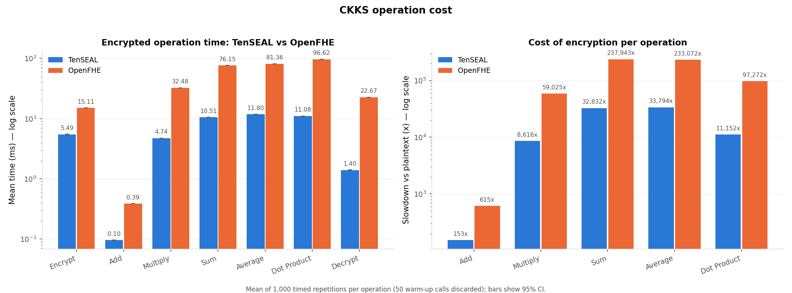
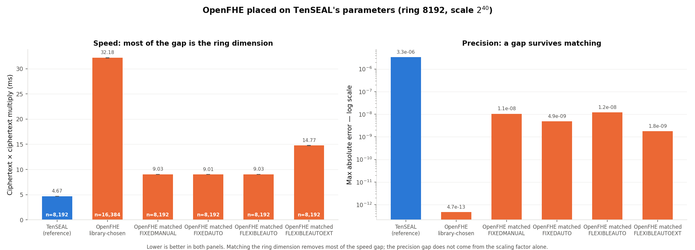

# In-Depth Analysis of Homomorphic Encryption Libraries

**Itai Zloclzower, Jacob Shemesh, Tomer Ovadia, Yoni Glickstein**
Confidential Computing, Ben-Gurion University of the Negev — July 2026

---

## 1. Introduction and Goal

Homomorphic Encryption (HE) allows computation directly on ciphertexts, so a cloud provider can process data it cannot read. This project compares **TenSEAL** (built on Microsoft SEAL) and **OpenFHE**, both implementing the **CKKS** scheme for approximate arithmetic on real numbers, against a plaintext baseline.

**Research question:** what is the practical overhead of computing under HE, and how much of the measured difference between two libraries is a property of the *libraries* rather than of the *parameters* we gave them?

The work has three parts: the cost of individual encrypted operations (§3); a realistic multi-stage computation — a synthetic medical risk score over 1000 encrypted patients (§4); and whether CKKS confidentiality is sufficient for a scenario that releases decrypted results, which ours does (§5).

Four CKKS concepts are used throughout. The **ring dimension** sets the security level and dominates the cost of every operation. The **scaling factor** sets precision. **Multiplicative depth** limits sequential multiplications. **Slot packing** lets one ciphertext hold many values so a single operation advances all of them (SIMD).

## 2. Method

### 2.1 Configurations

| | TenSEAL 0.3.15 | OpenFHE 1.4.1 |
|---|---|---|
| Configured by | modulus chain given directly | depth + scaling size; library picks the rest |
| Parameters | `poly_modulus_degree=8192`, `coeff_mod=[60,40,40,60]` (200 bits), `scale=2^40` | `depth=3`, `scaling_mod_size=50`, `HEStd_128_classic` |
| Resulting ring dimension | 8192 | **16384** |

The two libraries are configured through different routes. That is convenient, and it is also a serious comparability problem — addressed directly in §3.5.

All mandatory operations were implemented for both libraries (key generation, encryption, addition, multiplication, summation, average, decryption), plus every optional extension: dot product, the risk score of §4, scaling tests, separately-timed key generation, the matched-parameter comparison of §3.5, and the IND-CPA$^D$ analysis of §5.

### 2.2 Measurement

Timing an HE operation once produces a number that is not reproducible. Every figure below is a **mean over 1000 repetitions after a discarded warm-up phase** (50 calls; 20 for multi-stage pipelines).

The warm-up matters because the first calls pay one-off costs that are not part of steady-state operation — loading the native library, lazily building NTT tables and evaluation-key caches, first-touch page faults, CPU frequency ramp-up. Including them inflates the mean *and* makes it depend on the repetition count, so two runs with different counts would not be comparable.

Three further precautions:

- **Robust statistics.** Timing distributions are bounded below with a long right tail, so the harness records median, 10% trimmed mean, MAD, IQR, p95/p99 and a bootstrap interval alongside the mean.
- **Drift detection.** The first half of the samples is compared against the second half; a gap above 5% means they are not from one distribution. Our first full run, on a shared login node at load average 10.4 on 8 cores, was flagged with drifts up to **30.9%** (TenSEAL dot product) and **73.2%** in one matched-comparison arm. Competing load cannot be averaged away, so everything here was re-measured on an **exclusive compute node**, single-threaded; worst drift afterwards was **2.9%** on encrypted measurements. Only the plaintext dot product stays flagged, at 5.1%, where timer resolution rivals the microsecond being measured.
- **Separation and gating.** `tracemalloc` distorts short timings, so memory is a separate pass. Garbage collection is disabled inside the timed loop, as `timeit` does. Each benchmark asserts its decrypted results against the plaintext reference before reporting timings, so a circuit that runs out of levels fails loudly instead of reporting numbers computed on garbage. 40 unit tests cover the statistics, the risk score, and the padding invariant of §4.2.

**Environment.** Exclusive SLURM node `ise-cpu-intl-18`; Intel Xeon E5-2680 v3 @ 2.50 GHz; `OMP_NUM_THREADS=1`; load average 1.01 at start; Rocky Linux 9.7; Python 3.8.20; NumPy 1.24.4. Single-threading is deliberate: both libraries use multithreaded native code, so on a shared machine their cost depends on how many cores they won, which is not a library property. Absolute times are therefore higher than a multithreaded run — **the ratios are the transferable result.**

## 3. Primitive Operations

Input vector `[1.0, 2.0, 3.0, 4.0, 5.0]`. "rel. SD" is the spread of individual calls; "CI" the 95% interval on the mean.

| Operation | Plaintext (ms) | TenSEAL (ms) | CI ± | rel. SD | OpenFHE (ms) | CI ± | rel. SD | TS vs plain | FHE vs plain |
|---|---|---|---|---|---|---|---|---|---|
| Encrypt | — | 5.4914 | 0.010 | 2.9% | 15.1101 | 0.009 | 1.0% | — | — |
| Add | 0.000629 | 0.0961 | 0.000 | 2.9% | 0.3869 | 0.000 | 1.5% | 153× | 615× |
| Multiply | 0.000550 | 4.7413 | 0.011 | 3.7% | 32.4827 | 0.020 | 1.0% | 8,616× | 59,025× |
| Sum | 0.000320 | 10.5082 | 0.007 | 1.0% | 76.1546 | 0.038 | 0.8% | 32,832× | 237,943× |
| Average | 0.000349 | 11.7961 | 0.026 | 3.6% | 81.3563 | 0.068 | 1.3% | 33,794× | 233,072× |
| Dot Product | 0.000993 | 11.0764 | 0.006 | 0.9% | 96.6155 | 0.044 | 0.7% | 11,152× | 97,272× |
| Decrypt | — | 1.4029 | 0.002 | 2.7% | 22.6702 | 0.018 | 1.3% | — | — |
| **Total** | **0.002841** | **45.1123** | | | **324.7763** | | | **15,876×** | **114,299×** |



Per-operation overhead varies by more than two orders of magnitude — 153× for addition against 32,832× for summation in TenSEAL — so any single "HE is N× slower" figure is misleading. Addition is nearly free; the rotation-heavy operations (sum, average, dot product) each need a $\log_2(\text{slots})$ sequence of rotate-and-add steps, every one a key switch, and cost 100–120× an addition. TenSEAL is faster on every operation, by 2.75× to 16.2× — but §3.5 shows most of that is a parameter choice.

**A correction on methodology.** An earlier draft argued that because 1000 repetitions drove every confidence interval below a few percent, the measurements were trustworthy. Our own data disproved that. A confidence interval measures how consistent the samples are *with each other*, assuming they are independent draws from one distribution; when a competing job lands mid-run that assumption fails and the interval does not notice. The contaminated run had narrow intervals *and* 73% drift. **Precision is not accuracy**, and only the drift check caught it.

### 3.1 Key Generation

One-off setup cost over 50 repetitions: **TenSEAL 216.180 ms** (± 0.281), **OpenFHE 208.308 ms** (± 0.206), covering context construction, key pairs and each library's evaluation keys.

This is the only measurement where OpenFHE wins, and the two are within 4%. Setup also dominates short sessions: TenSEAL's key generation costs nearly five times its entire 45 ms benchmark of encrypted operations, so a service creating a fresh context per request would be bottlenecked on setup, not computation.

### 3.2 Memory and Ciphertext Size

An earlier version of this report presented `tracemalloc` figures — all under 1 KB — as memory usage. **That was misleading and is corrected here.** `tracemalloc` sees Python allocations only; both libraries hold ciphertext coefficients in native heaps. Those sub-kilobyte numbers were the size of Python wrapper objects, not of the ciphertexts they point at. Measuring resident-set growth across many live ciphertexts instead:

| Measure | TenSEAL | OpenFHE |
|---|---|---|
| Python-traced (`tracemalloc`), encrypt | 0.59 KB | 0.42 KB |
| **Resident memory per ciphertext** | **359,465 bytes** | **1,258,455 bytes** |
| Serialized ciphertext | 334,428 bytes | 1,312,467 bytes |

The real figure is roughly **six orders of magnitude larger** than the Python-traced one, and resident and serialized sizes agree within ~7% — a useful cross-check between two independent measurements. For a 5-element vector TenSEAL's ciphertext is 334 KB against 40 bytes of plaintext, an expansion of about **8,360×**. This, not RAM, is the practical obstacle in a cloud setting: it is what crosses the network. §4.4 shows the ratio improves greatly once slots are used.


### 3.3 Approximation Error

| Operation | TenSEAL | OpenFHE | Ratio |
|---|---|---|---|
| Add | $1.57 \times 10^{-9}$ | $4.09 \times 10^{-14}$ | $3.8 \times 10^{4}$ |
| Multiply | $3.35 \times 10^{-6}$ | $1.96 \times 10^{-12}$ | $1.7 \times 10^{6}$ |
| Sum | $4.60 \times 10^{-7}$ | $7.11 \times 10^{-15}$ | $6.5 \times 10^{7}$ |
| Average | $3.10 \times 10^{-7}$ | $5.20 \times 10^{-14}$ | $6.0 \times 10^{6}$ |
| Dot Product | $5.19 \times 10^{-6}$ | $3.27 \times 10^{-13}$ | $1.6 \times 10^{7}$ |

OpenFHE is $10^{4}$–$10^{7}$ times more precise in this configuration. Multiplication introduces the largest error in both, as expected — it raises ciphertext noise and rescaling discards precision. All errors are negligible for the target applications, where aggregates are meaningful to a few decimal places. The *cause* of the gap is not what we assumed: see §3.5.

### 3.4 Scaling with Vector Size

End-to-end pipeline (encrypt + add + multiply + sum + average + decrypt); context and keys built once per size and excluded from the timing.

| Vector size | Plaintext (ms) | TenSEAL (ms) | OpenFHE (ms) | TS vs plain | FHE vs plain | FHE / TS |
|---|---|---|---|---|---|---|
| 5 | 0.001309 | 37.16 | 301.55 | 28,389× | 230,368× | 8.1× |
| 10 | 0.001683 | 51.13 | 347.45 | 30,383× | 206,446× | 6.8× |
| 50 | 0.004772 | 98.95 | 451.32 | 20,735× | 94,576× | 4.6× |
| 100 | 0.008711 | 119.99 | 501.16 | 13,774× | 57,532× | 4.2× |
| 500 | 0.044284 | 271.19 | 607.03 | 6,124× | 13,708× | 2.2× |

Across that 100× increase in data, plaintext time grows 33.8× (essentially linear) but **TenSEAL only 7.3× and OpenFHE only 2.0×**. Per-element cost falls from 7.43 ms to 0.54 ms for TenSEAL (13.7×) and from 60.31 ms to 1.21 ms for OpenFHE (49.7×).


This sublinear scaling is the strongest practical argument for HE, and the reason is slot packing: cost is set by the ring dimension, not by how many slots hold data. OpenFHE held its ring dimension at 16,384 across the sweep, so the dominant cost was identical for 5 elements and for 500 — at n=5 the benchmark pays for thousands of slots to compute on five numbers. Only the rotation count, $\log_2(\text{batch size})$, grows. **Under-filling ciphertexts is the most wasteful thing you can do in CKKS**, and even at n=500 neither library is full. Quoting an HE slowdown without saying how full the ciphertexts were is close to meaningless — OpenFHE's overhead falls from 230,368× to 13,708× within this one table.

### 3.5 Matched-Parameter Comparison

Taken at face value, the sections above say "TenSEAL is faster, OpenFHE is more precise." That is not supportable: OpenFHE was doing twice the polynomial work per operation and keeping ten more bits of each value. `SetRingDim` (with `HEStd_NotSet`) pins it to 8192 with a $2^{40}$ scale and 60-bit first modulus — matching TenSEAL. We also swept OpenFHE's *scaling technique*, which turned out to matter.

| Arm | Ring | Scale | Multiply (ms) | vs TenSEAL | Mul error | Precision vs TenSEAL |
|---|---|---|---|---|---|---|
| TenSEAL (reference) | 8192 | $2^{40}$ | 4.674 | 1.00× | $3.34 \times 10^{-6}$ | 1× |
| OpenFHE, library-chosen | 16384 | $2^{50}$ | 32.181 | 6.89× | $4.71 \times 10^{-13}$ | 7,098,215× |
| OpenFHE matched, FIXEDMANUAL | 8192 | $2^{40}$ | 9.031 | 1.93× | $1.05 \times 10^{-8}$ | 317× |
| OpenFHE matched, FIXEDAUTO | 8192 | $2^{40}$ | 9.008 | 1.93× | $4.87 \times 10^{-9}$ | 687× |
| OpenFHE matched, FLEXIBLEAUTO | 8192 | $2^{40}$ | 9.031 | 1.93× | $1.21 \times 10^{-8}$ | 275× |
| OpenFHE matched, FLEXIBLEAUTOEXT | 8192 | $2^{40}$ | 14.772 | 3.16× | $1.77 \times 10^{-9}$ | 1,890× |



1. **Most of the speed gap was the ring dimension.** Multiplication falls from 6.89× to **1.93×** once parameters match, and encryption converges to within 2% (5.55 ms against 5.44) where the unmatched comparison showed 2.75×.
2. **The precision gap is *not* the scaling factor, which is what we previously claimed.** At an identical $2^{40}$ scale OpenFHE is still **275–1,890×** more precise. The two effects are comparable in size: ten extra scaling bits account for roughly $10^3$, the implementation for another $10^3$. Our earlier explanation was wrong, and this experiment is what disproved it.
3. **Scaling technique is a real tunable trade-off** inside OpenFHE: `FLEXIBLEAUTOEXT` is 1.64× slower than the others and about 6× more precise. It is invisible unless you go looking.
4. **The comparison is security-fair.** Pinning the ring dimension disables OpenFHE's own check, so we verified the modulus it built: 181–200 bits against TenSEAL's 200, both inside the 218-bit ceiling SEAL's published table gives for ring dimension 8192 at 128-bit classical security.

The honest conclusion is a **trade-off curve, not a ranking**. A residual library difference survives — about 2× on multiplication and $10^3$ on precision — but it is far smaller than the raw comparison suggests.

## 4. Applied Use Case — Encrypted Synthetic Medical Risk Score

> **Disclaimer.** This risk score is a **synthetic construct for demonstration only**. It is **not** a validated clinical model, is not derived from medical literature, and must not be read as a real assessment of patient risk. The cohort is synthetic too. Its purpose is to give the benchmark a computation with realistic *structure* — several inputs, mixed arithmetic, genuine multiplicative depth — not to model medicine.

### 4.1 Scenario and Score

A hospital holds 1000 patient records, five measures each, and wants a cloud provider to compute a per-patient risk score **and** the cohort mean without exposing any individual value. The hospital encrypts before the data leaves; the cloud evaluates on ciphertexts; only the hospital can decrypt.

Each feature is min-max normalized, $x_{norm} = (x - min)/(max - min)$, against a **public** reference range — age 18–90, systolic BP 90–180, BMI 18–40, cholesterol 120–280, glucose 70–200:

```
risk_score = 100 * ( 0.15*age_norm + 0.20*bp_norm + 0.15*bmi_norm
                   + 0.15*cholesterol_norm + 0.15*glucose_norm
                   + 0.10*bp_norm*glucose_norm
                   + 0.05*bmi_norm*cholesterol_norm
                   + 0.05*bp_norm^2 )
```

The eight weights sum to 1.0, so a patient at the top of every range scores 100. The five linear terms need only multiplication by *public constants* — cheap, one level. The last three make this a real HE benchmark: two **interaction terms** and one **quadratic term**, each requiring **ciphertext × ciphertext** multiplication, which consumes multiplicative depth and forces relinearization.

The ranges are public deliberately: deriving min/max from the data would need comparisons between ciphertexts, which CKKS does not support natively, whereas public ranges keep normalization an affine map that CKKS does cheaply.

**Cohort** (1000 patients, seed 20260730): age uniform, the four clinical measures normal around a plausible centre then clipped to range so every normalized value stays in [0,1]. Generated means — age 53.57 (SD 21.27), BP 124.85 (15.49), BMI 27.13 (4.29), cholesterol 201.63 (34.84), glucose 101.98 (18.91) — give scores of mean **35.63**, SD **8.45**, range **9.36–68.90**.

### 4.2 Encrypted Implementation

**Packing.** One feature per ciphertext, one slot per patient — five ciphertexts of 1000 values, so one multiplication advances all 1000 patients. This is the single most important design decision; one ciphertext per patient would multiply the operation count by 1000.

**Padding.** Vectors are padded to 1024 slots (OpenFHE requires a power of two), filled with **each feature's range minimum** so they normalize to exactly 0 and drop out of every term and the cohort sum. Padding with zeros instead gives those slots a *nonzero* normalized value of $-min/(max-min)$ and silently corrupts the cohort mean. A unit test pins this invariant, because it is exactly the kind of error that produces plausible-looking wrong numbers.

**Depth.** Normalization (1) + interaction/quadratic (1) + term weights (1) + cohort mean (1) = **4 levels**. Folding the ×100 into the eight weights saves one.

### 4.3 Depth, Not Data Volume, Drives Cost

The §3 parameters **cannot run this circuit**. Sweeping both libraries:

| Configuration | Result |
|---|---|
| TenSEAL, `poly=8192`, `[60,40,40,60]` (§3 parameters) | **Fails** — `scale out of bounds` |
| TenSEAL, `poly=8192`, any longer chain | **Context rejected** |
| TenSEAL, `poly=16384`, 3 / **4** / 5 levels | fails / **works, adopted** / works but ~30% slower |
| OpenFHE, depth 2 / 3 / **4** / 5 | fails / score works but cohort mean fails / **works at ring 16384, adopted** / works but ring jumps to 32768 |

The rejection is not a quirk: SEAL's published table caps the coefficient modulus at **218 bits for ring 8192** and 438 for 16384 at 128-bit security. `[60,40,40,60]` is 200 bits and fits; `[60,40,40,40,60]` is 240 and does not. Error message and published standard agree.

Three findings follow. **(i)** A modest increase in circuit complexity forces new cryptographic parameters: depth 2 → 4 means the chain no longer fits at ring 8192, so the ring dimension doubles and *every* operation roughly doubles in cost. **(ii) Asking for more depth than needed is a real and easy mistake** — our first implementation requested OpenFHE depth 5, which works but pushes the ring to 32,768, doubling the work for no benefit. Depth is not a free safety margin. **(iii) Depth costs more than data volume**: slot packing makes 5 → 1000 values nearly free, while one extra ciphertext × ciphertext multiplication can cost a doubling of the ring dimension.

### 4.4 Results

Both libraries are at ring 16384 here, unlike §3. Mean of 1000 repetitions.

| Stage | Runs at | Plaintext (ms) | TenSEAL (ms) | OpenFHE (ms) |
|---|---|---|---|---|
| Encrypt 5 features | Hospital | — | 76.784 | 84.650 |
| Score evaluation | Cloud | 0.0593 | 89.249 | 163.181 |
| Cohort mean | Cloud | 0.0748 | 46.104 | 146.054 |
| Decrypt scores | Hospital | — | 2.186 | 17.457 |
| **Pipeline total** | | **0.0593** | **214.323** | **411.341** |
| **Overhead vs plaintext** | | **1×** | **3,614×** | **6,936×** |
| **Per patient** | | **0.000059** | **0.2143** | **0.4113** |
| Cloud-side work only | Cloud | 0.0593 | 135.353 | 309.235 |

| Accuracy metric | TenSEAL | OpenFHE |
|---|---|---|
| Max absolute error (score points) | $4.881 \times 10^{-4}$ | $1.976 \times 10^{-10}$ |
| Max relative error | $1.369 \times 10^{-5}$ | $8.603 \times 10^{-12}$ |
| **Cohort mean, encrypted** (plaintext: 35.626948) | **35.627391** | **35.626948** |


The whole scenario runs in **214 ms** (TenSEAL) or 411 ms (OpenFHE) for 1000 patients, of which the untrusted cloud does 135 ms and 309 ms, never holding a plaintext value. Per-patient cost is **0.21 ms / 0.41 ms** — the number that decides deployability, and it is small.

The overhead is far below that of the isolated primitives: 3,614× here against 15,876× in §3. Nothing became faster; the ciphertexts became fuller. **Micro-benchmarks systematically overstate the cost of HE.** Ciphertext expansion amortizes the same way — 1,053,344 bytes per encrypted feature means about **5.0 MB** uploaded for the whole cohort against 40,000 bytes of plaintext, an expansion of **132×** rather than 8,360×.

Accuracy far exceeds what the application needs: TenSEAL's worst per-patient error is $4.9 \times 10^{-4}$ points on a 0–100 scale. Error does accumulate with depth — two orders of magnitude worse than a single multiplication in §3.3 — because four chained levels each discard precision at rescaling.

## 5. Security: Is Encrypting Enough?

Everything above treats confidentiality as settled once the data is encrypted. It is not, and the gap is specific to *approximate* HE. This is the section we would most want a reader to take away, because it changes what you would deploy.

### 5.1 The Threat Model Our Scenario Needs

CKKS is IND-CPA secure. IND-CPA says nothing about releasing *decryption results* — and our scenario releases them: the hospital decrypts the cohort mean and publishes it.

Li and Micciancio (EUROCRYPT 2021) showed this matters. A CKKS decryption returns the message *plus an error term that depends on the secret key*; an adversary collecting enough approximate decryptions can solve for the key. They defined **IND-CPA$^D$** — indistinguishability with a decryption oracle — showed CKKS does not achieve it, and demonstrated practical key recovery against HEAAN, **SEAL**, HElib and PALISADE. SEAL is the library TenSEAL wraps. The attack is passive; it needs no misbehaviour beyond answering decryption requests.

### 5.2 What the Libraries Do, and What the Defence Costs

The observable signature of any decryption-noise defence is **randomization**: plain CKKS decryption is deterministic, so decrypting one fixed ciphertext repeatedly must return identical results. Measured over 32 trials:

| Configuration | Randomized? | Max spread |
|---|---|---|
| TenSEAL (no such setting exists) | **No** | **exactly 0** |
| OpenFHE, `FIXED_NOISE_DECRYPT` (default) | Yes | $5.71 \times 10^{-11}$ |
| OpenFHE, `NOISE_FLOODING_DECRYPT` | Yes, calibrated | $1.28 \times 10^{-13}$ |

**In the version tested, TenSEAL's decryption is bit-deterministic**, so the released value carries exactly the key-dependent error the attack exploits, and TenSEAL exposes no setting to change it. OpenFHE randomizes by default — which surprised us; we expected the baseline arm to be bare.

OpenFHE's flooding mitigation needs a **two-pass protocol**, because the flooding noise must exceed the circuit's own error: pass 1 (`EXEC_NOISE_ESTIMATION`) runs the circuit and reads the noise via `GetLogError()` — ours returned $2^{9.82}$ — and pass 2 (`EXEC_EVALUATION`) rebuilds the context with that estimate.

| | Encrypt | Multiply | Sum | **Decrypt** |
|---|---|---|---|---|
| Baseline (ms) | 16.851 | 40.142 | 198.404 | 24.946 |
| Flooded (ms) | 16.864 | 40.022 | 198.469 | **35.536** |
| Slowdown | 1.00× | 1.00× | 1.00× | **1.42×** |


Flooding costs **1.42× on decryption and nothing anywhere else**, plus an entire extra pass for estimation. For batch analytics that decrypts once per query this is close to free — the estimation pass, not the flooding, is the real cost.

### 5.3 Why We Do Not Claim This Makes It Secure

This is where an earlier draft of this report was wrong. OpenFHE estimates circuit noise **empirically**, from precision loss in the imaginary slots of a trial decryption — an **average-case** estimate. Guo, Nabokov, Suvanto and Johansson (USENIX Security 2024) show that noise flooding built on non-worst-case estimation remains vulnerable to key recovery, explicitly including deployments implementing the differential-privacy bounds of Li, Micciancio, Schultz and Sorrell (CRYPTO 2022). Average-case analysis assumes independent input ciphertexts; our risk-score circuit combines correlated ones.

Provable IND-CPA$^D$ flooding needs variance high enough to cost substantial precision (PKC 2025), and OpenFHE's own follow-up work (ePrint 2024/203) exists specifically to counter the Guo et al. attacks — as a proof of concept, not the default of release 1.4.1.

**So §5.2 measures the cost of a partial defence, not the cost of security.** Randomized decryption shows a defence is *active*, not *sufficient*; we did not mount the attack or verify any bound. The practical recommendation: for any deployment releasing decrypted values, treat library choice as a security decision and not only a performance one, and reason about the released aggregate — not the ciphertext — as the asset to protect.

## 6. Usability

| Aspect | TenSEAL | OpenFHE |
|---|---|---|
| Installation | `pip install`, all platforms and Python versions | **Linux only**, wheel built for one specific CPython version |
| API style | High-level, Pythonic (`enc + enc`, `enc.sum()`) | Low-level, explicit (`cc.EvalAdd(ct, ct)`) |
| Parameter control | Modulus chain given explicitly | Depth given; ring dimension chosen by the library |
| Scaling technique | Not exposed | Four options, real speed/precision trade-off (§3.5) |
| Decryption-noise defence | **None** | Default fixed noise; opt-in calibrated flooding |

TenSEAL is far easier for prototyping and teaching: keys are managed automatically, batch size is unconstrained, and the benchmark took 92 lines against OpenFHE's 111. OpenFHE offers more control over the security/precision trade-off — including controls that matter a great deal (§3.5, §5) and that TenSEAL does not expose at all. One genuine advantage of its style emerged here: because depth is declared up front, exceeding it fails immediately, whereas TenSEAL's failure surfaced later as `scale out of bounds`, whose connection to chain length is not obvious.

## 7. Related Work

CKKS was introduced by **Cheon, Kim, Kim & Song (ASIACRYPT 2017)**. **Li & Micciancio (EUROCRYPT 2021)** defined IND-CPA$^D$ and demonstrated key recovery against CKKS implementations including SEAL — the basis of §5. **Li, Micciancio, Schultz & Sorrell (CRYPTO 2022)** proved security under noise flooding, at substantial precision cost. **Guo et al. (USENIX Security 2024)** then broke flooding built on *non-worst-case* noise estimation, which is what OpenFHE implements — directly bounding what we can claim in §5.3. **PKC 2025** analyses concrete security at reduced noise, and **ePrint 2024/203** proposes application-aware CKKS to close the gap. **Microsoft SEAL's parameter tables** supply the 218/438-bit ceilings used in §3.5 and §4.3.

Our contribution is not new cryptanalysis: it is an empirical, like-for-like measurement of two libraries under *matched* parameters, and a measurement of what the IND-CPA$^D$ defence costs in a concrete application — together with the observation that one of the two provides no such defence at all.

## 8. Limitations

1. **Single machine, single thread.** Ratios transfer; absolute times do not. Multithreaded behaviour may differ non-uniformly between the libraries and was not measured. Library versions are also a snapshot, and the security landscape of §5 is actively changing.
2. **Confidence intervals do not certify a measurement.** Our first run produced narrow intervals on contaminated data (§3). Drift diagnostics now accompany every interval, but the general lesson stands.
3. **The matched comparison covers one operating point** (ring 8192, $2^{40}$). We also disabled OpenFHE's automatic security check to pin the ring dimension; the resulting modulus was verified against SEAL's published ceiling, but that check is now our assertion rather than the library's.
4. **The security analysis is not cryptanalysis.** We did not implement or mount the Li–Micciancio attack, or verify any bound. §5 measures observable behaviour and the cost of an available mitigation; whether a configuration is IND-CPA$^D$ secure we defer to the literature, which says the one we measured is **not** known to be. We also did not characterise what property OpenFHE's default `FIXED_NOISE_DECRYPT` is intended to provide.
5. **The risk score is synthetic in every sense** — formula, weights and cohort are constructed, and nothing in §4 supports any clinical claim. Memory measurement is likewise coarse: resident-set growth is attributed evenly across allocations and cannot separate ciphertext from allocator overhead, so its ~7% agreement with serialized size is reassuring rather than a proof.
6. **No bootstrapping.** Every circuit here fits a fixed level budget; deeper computation would need bootstrapping, whose cost would dominate everything measured.

## 9. Conclusions

1. **"How expensive" depends on the operation and on how full the ciphertexts are.** Overhead ranged from 153× for an encrypted addition to 32,832× for a summation on a 5-element vector, then fell to 3,614× for the whole risk-score pipeline once 1000 values shared each ciphertext. No single multiplier describes "the cost of HE".
2. **Rigorous measurement changed the numbers, then the conclusions.** Contaminated runs showed drifts up to 73% while displaying narrow confidence intervals; an exclusive node cut worst-case drift to 2.9% and materially changed the matched-comparison result.
3. **Circuit depth, not data volume, is the cost driver.** Slot packing makes 1000 patients almost as cheap as 5, while two interaction terms and a quadratic term raised the required depth from 2 to 4, doubled the ring dimension, and slowed every operation. Over-provisioning depth doubles it again for nothing.
4. **Most of the apparent library gap was a parameter gap.** Matched, OpenFHE's multiplication penalty falls from 6.89× to 1.93× and encryption becomes indistinguishable. A $10^3$ precision gap survives, so our earlier explanation — the extra scaling bits — was wrong; both factors contribute about equally.
5. **Privacy-preserving analytics on a realistic computation is feasible today**: 1000 patients scored in 214 ms, the cloud never seeing a plaintext value, agreeing with the reference to five significant figures.
6. **Encryption is not the whole security question, and this is where library choice matters most.** Our scenario releases decrypted aggregates — exactly where CKKS is not IND-CPA$^D$ secure. TenSEAL's decryption is bit-deterministic with no mitigation available; OpenFHE randomizes by default and offers calibrated flooding for 1.42× on decryption. But that rests on average-case noise estimation, which published attacks defeat, so we measured a *partial* defence — an open problem, not a solved one.

## 10. References

1. Cheon, Kim, Kim & Song. Homomorphic encryption for arithmetic of approximate numbers. *ASIACRYPT 2017*.
2. Li & Micciancio. On the security of homomorphic encryption on approximate numbers. *EUROCRYPT 2021*. `eprint.iacr.org/2020/1533`
3. Li, Micciancio, Schultz & Sorrell. Securing approximate homomorphic encryption using differential privacy. *CRYPTO 2022*.
4. Guo, Nabokov, Suvanto & Johansson. Key recovery attacks on approximate homomorphic encryption with non-worst-case noise flooding countermeasures. *USENIX Security 2024*.
5. Revisiting the security of approximate FHE with noise-flooding countermeasures. *PKC 2025*. `eprint.iacr.org/2024/424`
6. Application-aware approximate homomorphic encryption. *ePrint 2024/203*. Project repositories: TenSEAL, OpenFHE, Microsoft SEAL.

---

*Code, notebook and charts accompany this report; every figure is regenerable with `./run_all_benchmarks.sh` (see `README.md`).*
